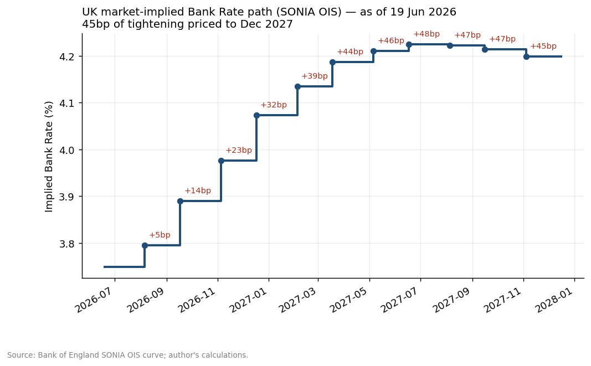
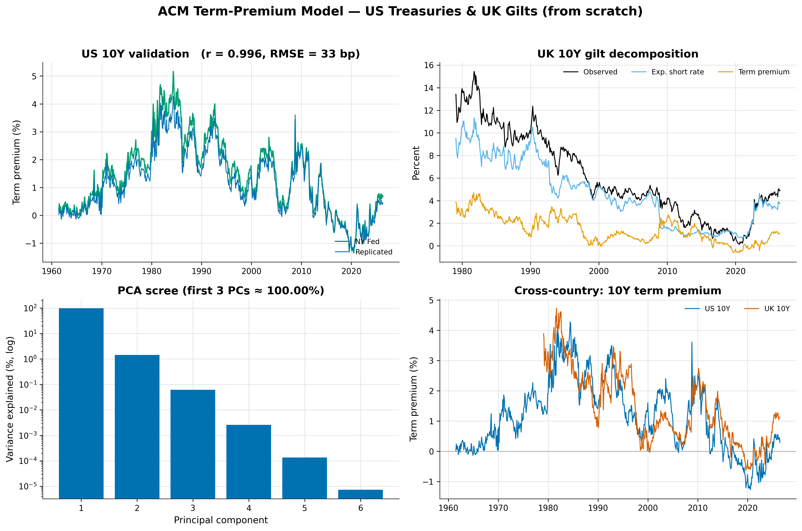
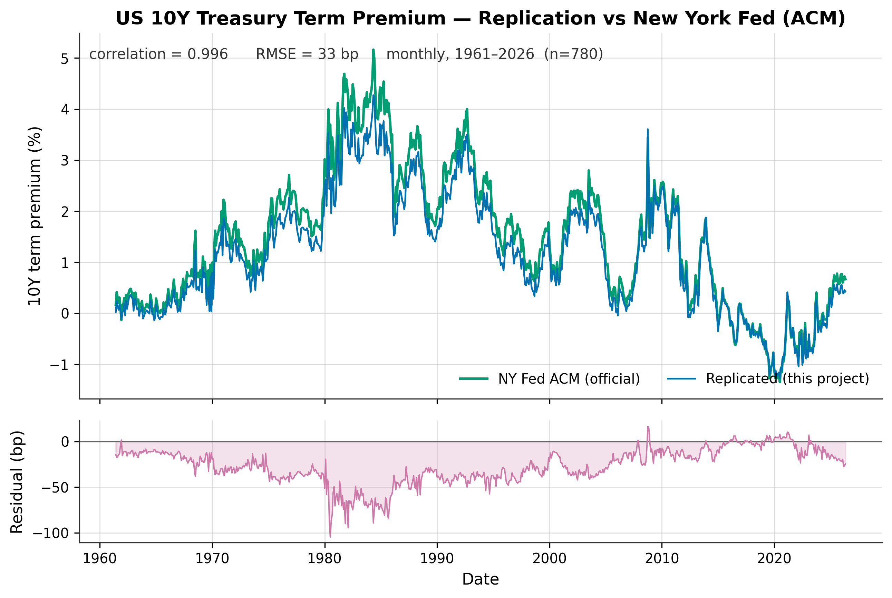

# UK Gilt / SONIA OIS Yield-Curve Construction, Forward Extraction & Term-Premium Decomposition

A research-grade fixed-income project that reads **what the market prices about
future monetary policy, inflation and risk premia** out of UK rates. The spine
of the project is one decomposition:

> **nominal yield = expected average short rate + term premium**

and its inflation analogue (`breakeven = expected inflation + inflation risk
premium − liquidity premium`). Everything here — curve construction,
bootstrapping, forwards, the policy path, and the planned term-premium model —
exists to populate that decomposition and then ask *where the market's implied
story disagrees with macro fundamentals.*

This is **SONIA-native** (post-LIBOR): the GBP risk-free discount curve is the
SONIA OIS curve, and Bank Rate expectations are read from **meeting-dated OIS**.

---

## What is implemented

A complete, tested, real-data pipeline for **Objectives 1–6**:

1. **Curve construction** — ingest the Bank of England's published SONIA OIS curve.
2. **Bootstrapping** — strip discount factors from par OIS quotes, from scratch.
3. **Forward extraction** — zero rates, instantaneous and period forwards.
4. **Implied Bank Rate path** — forwards sliced at MPC meeting dates (≈ WIRP).
5. **Yield-curve PCA** — level/slope/curvature pricing factors (`premium/pca.py`).
6. **Term-premium decomposition (ACM)** — split the nominal gilt yield into an
   expected-average-short-rate component and a term premium, via a from-scratch
   Adrian–Crump–Moench affine model, *proven against the NY Fed's published series*
   (`premium/acm.py`; see [Term-premium decomposition](#term-premium-decomposition-acm)).

The numerical core is built from scratch in **numpy/scipy** — no black-box
pricing library on the critical path — so the mathematics is fully inspectable.
`rateslib` / `QuantLib` are wired in only as optional cross-validation
(`pip install -e ".[validate]"`).

### Headline result (BoE curve, as of 19 Jun 2026)



The front end prices a gradual rise in forward SONIA of **~+45bp to end-2027**.
Note this is the *raw* forward path, which conflates expected policy with term
premium — disentangling the two is the next phase (ACM), and is exactly why the
term-premium decomposition matters.

### Validation (on real BoE data, reported by the runner)

| Check | Result | What it proves |
|---|---|---|
| Bootstrap round-trip (par → DF → bootstrap) | **max |ΔDF| = 1.1e-16** | the bootstrap is the exact algebraic inverse of par pricing |
| Our forwards vs BoE's *published* instantaneous forwards | **RMSE = 0.16 bp** | the compounding convention matches the BoE's own |

The continuous-compounding convention (`D(t)=exp(−R(t)·t)`) was **pinned
empirically**, not assumed: it reproduces BoE's published forward curve to 0.3bp
vs 8.5bp for annual compounding.

---

## Term-premium decomposition (ACM)

The centerpiece: split the **nominal government-bond yield** into an
expected-average-short-rate component and a **term premium**, via a from-scratch,
regression-based **Adrian–Crump–Moench (ACM)** affine model. The estimator is
**currency-agnostic** — it consumes a generic zero-coupon yield panel plus a
currency *label* and never branches on it — so the same code runs on US Treasuries
and UK gilts and emits a tidy decomposed panel keyed by `(date, currency,
maturity)`, ready for a downstream cross-currency-basis project.



As of Jun 2026 the **10y gilt (≈4.87%)** splits into a **~3.74% expected average
short rate** and a **~113bp term premium**.

### Validation — US as the correctness anchor

The estimator is proven on **US Treasuries before it is trusted on gilts** (which
have no published benchmark): the *same* code runs on the Fed Board's GSW zero
curve and must reproduce the **New York Fed's published ACM term premia**
(1961–2026, 780 monthly observations). The runner **halts** if it doesn't.



| Check | Result | What it proves |
|---|---|---|
| GSW → our ACM vs NY Fed ACM, **10y** | **corr 1.00**, RMSE 33bp | the from-scratch estimator reproduces a published benchmark |
| GSW → our ACM vs NY Fed ACM, **5y** | **corr 0.99** | the match holds across the belly |
| Term-premium **shape** (US & GBP) | ≈0 at the short end, **rising to 10y** | correct affine behaviour (halt-on-failure) |
| GBP ACM 2y expected-rate vs **SONIA implied path** | gap **−11bp** | model-robustness; the gap is the expected gilt/OIS basis |

The gate is on the data-supported **5y/10y** tenors. The **1y/2y** correlations
(0.82/0.93) are reported but *not* gated: the GSW curve has no reliable sub-1y
data, so the 1-month risk-free is extrapolated, which biases the front-end premium
low — a documented data limitation, not an estimator error.

**Methods note.** Five PCA pricing factors (the first three are the classic
level/slope/curvature, explaining **>99.9%** of yield variance — 99.99% for gilts,
99.997% for GSW) feed a **VAR(1)** for their dynamics, then a **three-step OLS**
prices one-period excess holding returns to recover the prices of risk (λ₀, λ₁),
and **affine recursions** build `A_n, B_n`. The **fitted** yield uses the estimated
prices of risk; the **risk-neutral** yield sets them to zero; **expected-rate =
risk-neutral yield** and **term premium = fitted − risk-neutral**. Parameters are
estimated monthly and can be evaluated on the daily curve. The numerics are pure
numpy/scipy on the critical path. Run it:

```bash
python3 scripts/run_term_premium.py   # US anchor -> GBP decomposition; halts on failure
python3 figures/generate.py           # publication-quality figure set (PNG + SVG, 300 dpi)
```

The full figure set — per-tenor validation, term-premium heatmaps, the
cross-country differential, PCA/affine diagnostics, and the model pipeline —
lives in [`figures/`](figures/) (each as PNG and SVG).

---

## Architecture

```
curves/
├── data/
│   ├── raw/            # BoE / Fed / NY Fed downloads (re-fetchable; git-ignored)
│   └── processed/      # implied_policy_path.csv, term_premium_panel.csv
├── src/giltcurve/
│   ├── conventions.py          # day-count, spot<->DF (continuous)
│   ├── ingest/
│   │   ├── boe.py              # download + parse BoE SONIA OIS curve
│   │   ├── boe_gilt.py         # BoE nominal gilt zero curve (ACM input, 1979-)
│   │   └── fed.py              # GSW zero curve + NY Fed ACM (US validation anchor)
│   ├── curves/
│   │   ├── discount.py         # DiscountCurve (log-linear in log DF)
│   │   ├── ois_bootstrap.py    # par OIS -> discount factors (Step 2)
│   │   └── forwards.py         # zero/forward reporting tables (Step 3)
│   ├── policy/
│   │   ├── mpc.py              # MPC meeting-date calendar
│   │   └── meeting_dated.py    # implied Bank Rate path (Step 4)
│   ├── premium/
│   │   ├── pca.py              # PCA pricing factors (level/slope/curvature)
│   │   ├── acm.py              # ACM term-premium decomposition (from scratch)
│   │   └── panel.py            # decomposed panel + cross-currency differentials
│   └── viz/plots.py            # desk-style charts
├── scripts/
│   ├── run_policy_path.py      # SONIA OIS pipeline + validations
│   └── run_term_premium.py     # ACM: US anchor -> GBP decomposition (halt-on-fail)
├── tests/                      # 64 tests (TDD); real-data checks auto-skip offline
├── figures/                    # publication figure set (style.py + generate.py)
├── reports/figures/            # generated charts
└── notebooks/                  # (narrative analysis — roadmap)
```

## Quickstart

```bash
python3 -m pip install -e ".[dev]"   # or: pip install numpy scipy pandas matplotlib openpyxl xlrd pytest
python3 -m pytest                    # 64 passing (network-gated ingest checks auto-skip offline)
python3 scripts/run_policy_path.py   # downloads BoE curve, prints path + validations, saves charts
python3 scripts/run_term_premium.py  # US anchor -> GBP ACM term-premium decomposition
```

## Data

- **Source:** Bank of England published UK yield curves — the same curve the MPC
  and UK desks watch, with published methodology (Anderson–Sleath VRP spline).
  Free and fully reproducible; no terminal required.
  `https://www.bankofengland.co.uk/statistics/yield-curves`
- **Desk path:** a `bloomberg.py` adaptor returning the same
  `(asof, maturities, rates)` tuple — or raw par-swap quotes straight into
  `bootstrap_ois` — drops in unchanged.

## Roadmap (Objectives 5–8)

| Phase | Module | Note |
|---|---|---|
| Yield-curve PCA | `premium/pca.py` | **done** — level/slope/curvature; >99.9% of variance in first 3 PCs |
| **Term premium (ACM)** | `premium/acm.py` | **done** — currency-agnostic ACM; reproduces NY Fed ACM (10y corr 1.00) |
| Breakeven decomposition | `inflation/breakevens.py` | nominal vs index-linked gilts; **RPI wedge** + 2030 reform |
| Cross-checks & divergence | `notebooks/` | implied path vs Consensus; flag pricing inconsistent with fundamentals |

## Caveats

- **MPC dates** for 2026–2027 in `policy/mpc.py` are projected from the BoE's
  ~6-weekly cadence and should be reconciled against the official calendar.
- **SONIA → Bank Rate basis** (`bank_rate_minus_sonia_bp`) is a small, explicit
  parameter; it cancels from *changes* in the path, so the cumulative-bp figure
  is the robust headline.
- **ACM 1-month risk-free** is extrapolated where the curve has no sub-1y data
  (GSW starts at 1y), which biases the *front-end* (1y/2y) term premium low; the
  decomposition is validated and reported on **5y–10y**, where it reproduces the
  NY Fed ACM almost exactly.
- **ACM expected-rate vs SONIA path** is a *gilt*-vs-*OIS* comparison, so read it
  on shape/changes, not levels — the gap is the gilt/swap (asset-swap) basis.
