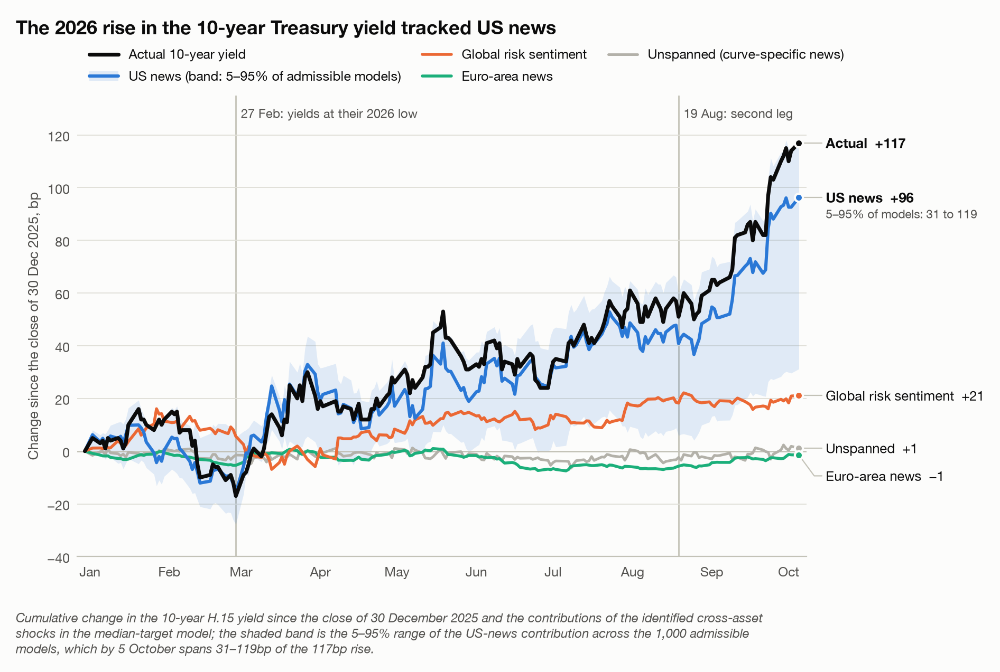
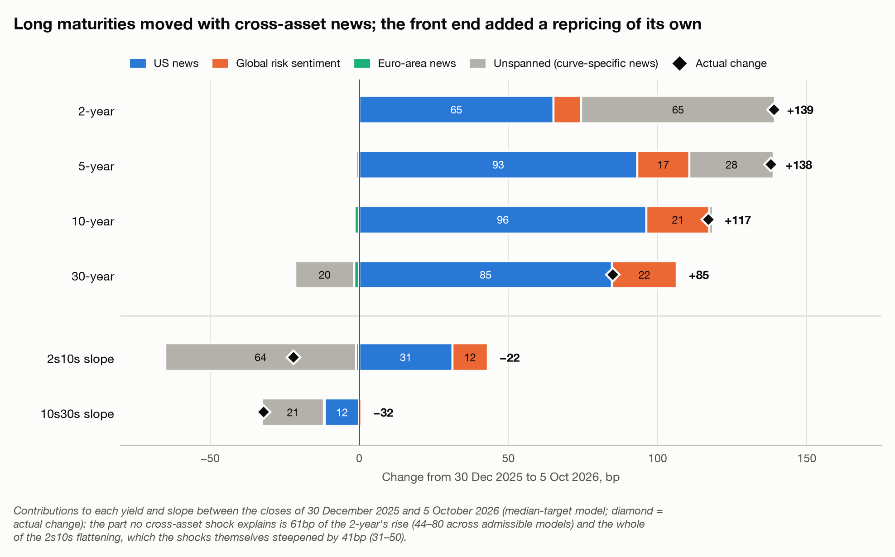
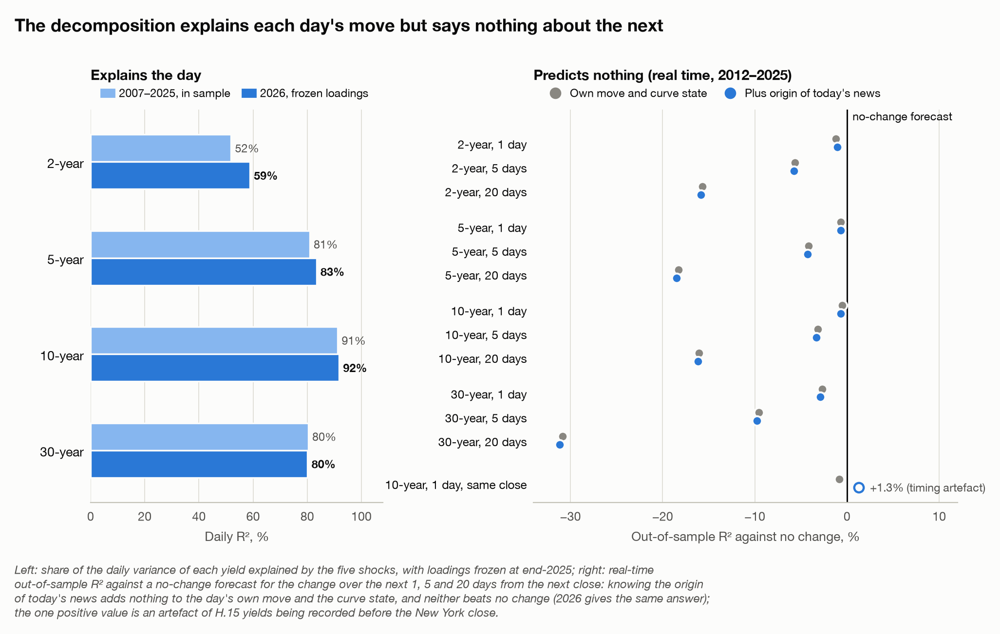

# What Drove the 2026 Treasury Selloff?

*A structural cross-asset decomposition of the US Treasury curve, using a sign-identified Bayesian VAR frozen at end-2025.*



**Main result.** Between the closes of 30 December 2025 and 5 October 2026 the 10-year Treasury yield rose 117bp and the 2-year 139bp.<sup>1</sup> At the long end the rise was news that also moved equities, the dollar and euro-area rates: the five identified cross-asset shocks account for essentially all of the 10-year's move, and US news is its largest source in 80% of admissible models (median 76bp; 5–95% range 31–119bp). The front end was different: about 61bp of the 2-year's rise (44–80bp) is a repricing of the expected policy path that no cross-asset shock explains, and it accounts for the whole 22bp bear flattening of 2s10s. The decomposition explains 59–92% of daily yield changes out of sample, but knowing what caused today's move does not help forecast the next one.

**Read:** [research note, with interactive figures](https://adambutlin.github.io/curves/output/2026_treasury_selloff.html) · [research brief](research_brief.md) · [evidence audit](EVIDENCE_AUDIT.md)

## Question

Why did Treasury yields rise in 2026, and did the drivers differ across the curve? The same 10bp rise can come from better growth news, a more hawkish policy path, a fading safe-haven bid or news from abroad, and each leaves a different fingerprint on equities, the dollar and foreign rates that day.

## Method

The model is the daily Bayesian VAR of Brandt, Saint Guilhem, Schröder and Van Robays (2021), estimated on prices recorded at the New York close over 2007–2025:

$$Y_t = c + \sum_{l=1}^{4} A_l Y_{t-l} + u_t, \qquad u_t = B\,\varepsilon_t ,$$

where $Y_t$ stacks daily changes in the 10-year euro-area OIS rate, the Euro Stoxx 50 future, the S&P 500, the euro-dollar rate and the euro-area minus US 10-year spread, $u_t$ are reduced-form innovations and $\varepsilon_t$ five structural shocks: US monetary, US macro, euro-area monetary, euro-area macro and global risk. Sign restrictions identify them: US news raises US yields by more than euro-area yields and strengthens the dollar, with US equities falling on monetary news and rising on macro news; a risk-off shock lowers yields and equities everywhere and strengthens the dollar. The restrictions admit a set of 1,000 models, and results are reported across that set.

The 2-, 5-, 10- and 30-year H.15 yields are attached by projecting each day's change on the shocks and two lags. What the shocks do not explain is *unspanned*: news specific to the Treasury curve. The model and loadings were frozen and hashed before any 2026 maturity data were read; nothing is re-estimated on 2026.

## Results

| 30 Dec 2025 to 5 Oct 2026 | 10-year | 2-year | How robust |
|---|---|---|---|
| Change in yield | +117bp | +139bp | data |
| Unspanned by cross-asset shocks | −2 (−25 to 25) | +61 (44–80) | independent of the sign restrictions |
| US news | +76 (31–119) | +53 (25–79) | positive in every model; largest source in 80% / 88% |
| Global risk sentiment | +24 (−2 to 74) | +12 (0–42) | weakly identified |
| Euro-area news | +11 (−1 to 47) | +8 (0–31) | weakly identified |
| US macro exceeds US monetary | in 53% of models | in 62% | not identified |

*Basis points; medians across admissible models, 5–95% ranges in brackets.*

The robust findings are the US origin of the news and the gap at the front end. How US news divides between growth and policy, and how the remainder divides between risk sentiment and euro-area news, the data do not pin down. After yields bottomed on 27 February the selloff came in three legs, March (+33bp at the 10-year), July (+31bp) and September (+54bp), each led by US news in most admissible models (87%, 65% and 86%).

## Across the curve



Every identified shock steepens the curve when it raises yields, so cross-asset news steepened 2s10s by 41bp (31–50). The 22bp bear flattening came entirely from front-end news that moved the 2-year without the equity, dollar or euro-area signature of any shock (−63bp; −72 to −53). The NY Fed's term-structure model places that news in expected short rates, not the term premium: 66bp of the 2-year's 99bp rise in expected rates is unspanned. It is a repricing of the expected policy path.

## Does the decomposition predict what happens next?



No. The frozen loadings explain 59–92% of daily 2026 yield changes, as much as in sample. But in real-time forecasts over 2012–2025, adding the origin of today's news to the day's move and the curve state never improves forecasts of the next 1, 5 or 20 days (Clark–West p ≥ 0.11 everywhere), and nothing beats a no-change forecast; 2026 agrees. An apparent same-close gain at the 10-year (R² +1.3%) is an artefact of H.15 yields being recorded before the New York close. The model is an attribution tool, not a forecasting model.

## Reproduction and data

```bash
pip install -e .
python scripts/build_research_output.py
```

This rebuilds the figures and the [research note](output/2026_treasury_selloff.html) from the derived tables in [`output/data/`](output/data/). The five model variables are licensed LSEG prices and are not redistributed; with a local LSEG cache the command first re-applies the frozen model and checks that it reproduces the committed results ([data/README.md](data/README.md)). Pre-registrations, model hashes and full write-ups: [docs/research/structural-propagation/](docs/research/structural-propagation/); the wider programme: [docs/project_overview.md](docs/project_overview.md).

## References

- Brandt, L., Saint Guilhem, A., Schröder, M. and Van Robays, I. (2021). What drives euro area financial market developments? The role of US spillovers and global risk. ECB Working Paper No. 2560.
- Arias, J. E., Rubio-Ramírez, J. F. and Waggoner, D. F. (2018). Inference based on structural vector autoregressions identified with sign and zero restrictions. *Econometrica*, 86(2), 685–720.
- Adrian, T., Crump, R. K. and Moench, E. (2013). Pricing the term structure with linear regressions. *Journal of Financial Economics*, 110(1), 110–138.
- Clark, T. E. and West, K. D. (2007). Approximately normal tests for equal predictive accuracy in nested models. *Journal of Econometrics*, 138(1), 291–311.

<sup>1</sup> The window starts at the 30 December close because Eurex, where the model's euro-area equity future trades, was shut on 31 December. From the 31 December close the 10-year rose 113bp.
