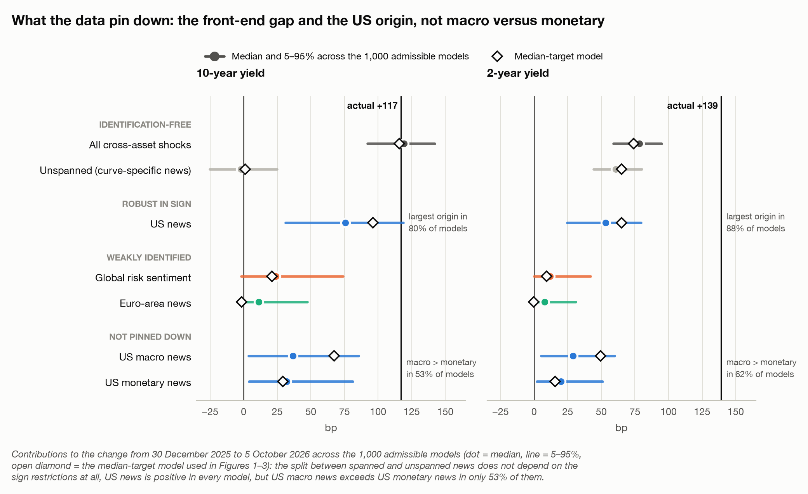

# What drove the 2026 Treasury selloff?

*Research brief, October 2026. Adam Butlin. Data to 5 October 2026.*

**Summary.** Between the closes of 30 December 2025 and 5 October 2026 the 10-year Treasury yield rose 117bp and the 2-year 139bp. A structural model that identifies the origin of each day's news from its cross-asset signature, frozen at end-2025, attributes the long-end rise to news that also moved equities, the dollar and euro-area rates, above all US news. The front end carried an additional repricing of the expected policy path that no cross-asset shock explains, and that repricing is the whole of the curve's bear flattening. The attribution is robust at the level of origin, fragile below it, and has no forecasting value.

## What happened

The 10-year H.15 yield fell from 4.14% to 3.97% by 27 February, then rose to 5.31% on 5 October, its high for the year. The 5-year rose 138bp and the 30-year 85bp, so the curve bear-flattened: 2s10s by 22bp, 10s30s by 32bp. Three legs carried the move, in March (10-year +33bp), July (+31bp) and September (+54bp), with small two-way moves in between. The S&P 500 rose 13% over the same window. Yields and equities rising together is the signature of good growth news or improving risk appetite, not of a pure risk-premium shock, which would push equities down. The NY Fed's term-structure model (Adrian, Crump and Moench, 2013) agrees: it puts 86bp of its 109bp fitted rise in the 10-year in expected short rates and 23bp in the term premium.

## Identification

The model is the daily Bayesian VAR of Brandt, Saint Guilhem, Schröder and Van Robays (2021) in five variables recorded at or near the New York close, estimated on 2007–2025 with four lags and a Minnesota prior. Reduced-form innovations map into five structural shocks through $u_t = B\varepsilon_t$, and $B$ is restricted only in sign on impact:

| Positive shock | Euro-area rate | Euro Stoxx | S&P 500 | Euro vs dollar | EA minus US spread |
|---|---|---|---|---|---|
| US monetary | + | | − | − | − |
| US macro | + | | + | − | − |
| Euro-area monetary | + | − | | + | + |
| Euro-area macro | + | + | | + | + |
| Global risk (risk-off) | − | − | − | − | + |

The spread restriction identifies the country of origin: a US shock moves US yields by more than euro-area yields. Equities separate growth from policy news within each economy. The global risk shock is a flight to safety, so a negative realisation of it, improving risk appetite, raises Treasury yields.

Sign restrictions identify a set of models. Rotations are drawn uniformly with the reduced-form posterior (Arias, Rubio-Ramírez and Waggoner, 2018) until 1,000 satisfy the restrictions, and every attribution below is a distribution across them. The figures also show the median-target model (Fry and Pagan, 2011), the one admissible model closest to the median impulse responses.

The 2-, 5-, 10- and 30-year H.15 yields are attached by projecting each day's change on the shocks and two lags, which absorb the earlier recording time of H.15 yields:

$$\Delta y_{\tau,t} = c_\tau + \sum_{k=1}^{5}\sum_{s=0}^{2}\theta_{\tau,k,s}\,\varepsilon_{k,t-s} + e_{\tau,t},$$

where $\Delta y_{\tau,t}$ is the daily change in the $\tau$-year yield. The part of a change that is not a linear function of the shocks is *unspanned*: news specific to the Treasury curve. It does not depend on the rotation. The model and loadings were frozen and hashed before any 2026 maturity data were read, and nothing is re-estimated on 2026. On 2007–2025 the model reproduces the published spillovers closely (US shocks explain 35% of the daily variance of the euro-area rate, against Brandt et al.'s 40%).

## What drove the selloff?

At the 10-year the five shocks account for the whole rise: the unspanned part is −2bp (−25 to 25 across admissible models). US news is the dominant origin. It raised the 10-year in every admissible model, is the largest of the three origins in 80% of them and accounts for more than half of the rise in 72%. Its median contribution is 76bp of the 117bp, with a 5–95% range of 31–119bp: the sign is certain, the size is not. In the median-target model US news contributes 96bp, improving global risk sentiment 21bp and euro-area news essentially nothing.

US news also led each leg, in 87% (March), 65% (July) and 86% (September) of admissible models. The dominant driver did not change during the year; what varied was the front end's additional repricing.

## What happened across the curve?

The 5-, 10- and 30-year yields moved with cross-asset news; the 2-year did not, entirely. Of its 139bp rise, 61bp (44–80bp) is unspanned, and the NY Fed's model locates it in expected short rates: 66bp of the 2-year's 99bp rise in expected rates is unspanned, against −10bp of its 36bp rise in the term premium. News that reprices the expected federal funds path without moving equities, the dollar or euro-area rates in a recognisable pattern is what data releases and Fed communication priced mainly at the front end would produce. A monetary shock identified from the 10-year rate does not capture it.

The curve shape follows. Each US and global shock steepens the curve when it raises yields (its 10-year loading exceeds its 2-year loading in at least 83% of admissible models), so cross-asset news steepened 2s10s by 41bp (31–50bp), and the 22bp bear flattening came entirely from the unspanned front-end repricing (−63bp; −72 to −53bp).

## How certain is the decomposition?

The results sort into four tiers by how much they depend on which admissible model is right.

1. **Independent of the sign restrictions:** the split between spanned and unspanned news, essentially nothing unspanned at the 10-year and about 61bp at the 2-year.
2. **Robust in sign:** US news raised yields at every maturity in every admissible model and is the largest origin in 78–88% of them.
3. **Weakly identified:** the remainder divides between global risk sentiment (10-year median 24bp, −2 to 74bp) and euro-area news (median 11bp, −1 to 47bp) in proportions the data do not determine. The median-target model's zero for euro-area news lies at the bottom of the set, so "no euro-area contribution" is not robust.
4. **Not identified:** US macro news exceeds US monetary news in 53% of models at the 10-year. The two differ only in the sign of the US equity response. A rise in the US term premium that lowers equities and strengthens the dollar has the same signature as US monetary news, so that label is wider than its name.

## Does knowing the cause predict what happens next?

No. The frozen loadings explain 59%, 83%, 92% and 80% of the daily variance of the 2-, 5-, 10- and 30-year yield in 2026, as much as in 2007–2025, so the structure was stable. But in real-time forecasts over 2012–2025, re-estimating everything each year on past data, adding the origin of today's news to the day's own move and the curve state never improves forecasts of the next 1, 5 or 20 days (Clark–West p ≥ 0.11 at every maturity and horizon), and no specification beats a no-change forecast. 2026 gives the same answer.

The one apparent exception is an artefact. Measured from the same close, today's news predicts tomorrow's 10-year H.15 change (out-of-sample R² +1.3%, p < 0.001) only because H.15 yields are recorded before the New York close, so tomorrow's change contains the end of today's news. From the next close the effect disappears. Earlier pre-registered work in this repository, on Treasuries over 1983–2025 with a different identification, reached the same verdict.

## Interpretation

The 2026 Treasury selloff was predominantly a US story: cross-asset news explains the long end, and US news is its largest source in most admissible models. Most of the rise was in expected rates rather than compensation for risk. Yields and equities rose together, the NY Fed's model puts four-fifths of the 10-year's rise in expected short rates, and the front end repriced the policy path beyond what daily cross-asset news implied. That repricing, not a long-end risk premium, flattened the curve.

For reading the Treasury market with such models, three lessons follow. Cross-asset sign restrictions say where news originates, not whether US news concerned growth or policy. The front end needs its own model of the policy path, because much of its news has no cross-asset signature. And attribution is not prediction: news is priced on the day, and knowing its origin adds nothing about the next.

This note applies an existing model; it makes no methodological claim. Its main limitations are the width of the identified set, the H.15 recording time (LSEG benchmark yields at every maturity would remove it), and the regime dependence of any mapping from this decomposition into expectations and term premia. Loadings estimated on 2007–2025, when the policy rate sat at its lower bound almost half the time, route cross-asset news into the term premium: they imply a rise of about 90bp in the 10-year term premium in 2026, against 23bp in the NY Fed's estimate. A lower bound mutes the response of expected rates to news (Swanson and Williams, 2014); away from it, the same news moves expected rates.

## References

Adrian, T., Crump, R. K. and Moench, E. (2013). Pricing the term structure with linear regressions. *Journal of Financial Economics*, 110(1), 110–138.

Arias, J. E., Rubio-Ramírez, J. F. and Waggoner, D. F. (2018). Inference based on structural vector autoregressions identified with sign and zero restrictions: theory and applications. *Econometrica*, 86(2), 685–720.

Brandt, L., Saint Guilhem, A., Schröder, M. and Van Robays, I. (2021). What drives euro area financial market developments? The role of US spillovers and global risk. ECB Working Paper No. 2560.

Clark, T. E. and West, K. D. (2007). Approximately normal tests for equal predictive accuracy in nested models. *Journal of Econometrics*, 138(1), 291–311.

Fry, R. and Pagan, A. (2011). Sign restrictions in structural vector autoregressions: a critical review. *Journal of Economic Literature*, 49(4), 938–960.

Swanson, E. T. and Williams, J. C. (2014). Measuring the effect of the zero lower bound on medium- and longer-term interest rates. *American Economic Review*, 104(10), 3154–3185.

*The window starts at the 30 December close because Eurex, where the model's euro-area equity future trades, was shut on 31 December; from the 31 December close the 10-year rose 113bp. Every number in this brief is computed in `output/data/` and listed in `output/data/headline_numbers.json`; sources are mapped in [EVIDENCE_AUDIT.md](EVIDENCE_AUDIT.md).*
